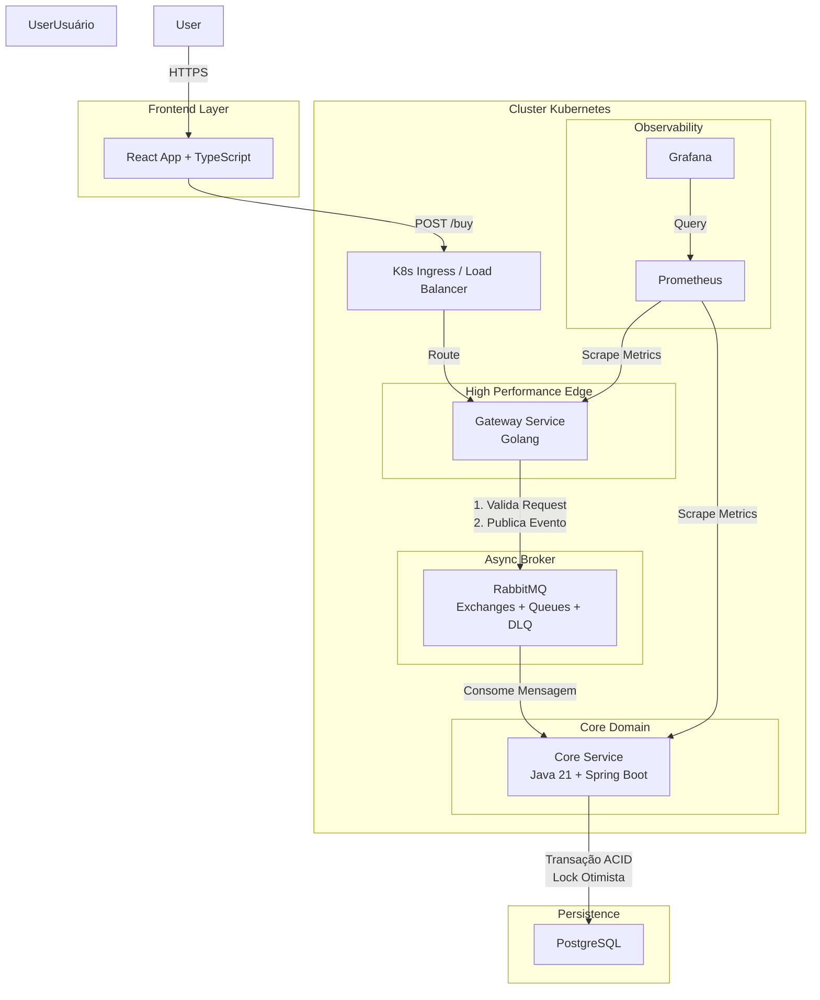

```mermaid
graph TD
    UserUsuário
    
    subgraph "Frontend Layer"
        SPA[React App + TypeScript]
    end

    subgraph "Cluster Kubernetes"
        Ingress[K8s Ingress / Load Balancer]
        
        subgraph "High Performance Edge"
            GoService[Gateway Service<br/>Golang]
        end
        
        subgraph "Async Broker"
            RabbitMQ[RabbitMQ<br/>Exchanges + Queues + DLQ]
        end
        
        subgraph "Core Domain"
            JavaService[Core Service<br/>Java 21 + Spring Boot]
        end

        subgraph "Observability"
            Prometheus[Prometheus]
            Grafana[Grafana]
        end
    end

    subgraph "Persistence"
        DB[PostgreSQL]
    end

    %% Fluxo
    User -->|HTTPS| SPA
    SPA -->|POST /buy| Ingress
    Ingress -->|Route| GoService
    GoService -->|1. Valida Request<br/>2. Publica Evento| RabbitMQ
    RabbitMQ -->|Consome Mensagem| JavaService
    JavaService -->|Transação ACID<br/>Lock Otimista| DB
    Prometheus -->|Scrape Metrics| GoService
    Prometheus -->|Scrape Metrics| JavaService
    Grafana -->|Query| Prometheus
```