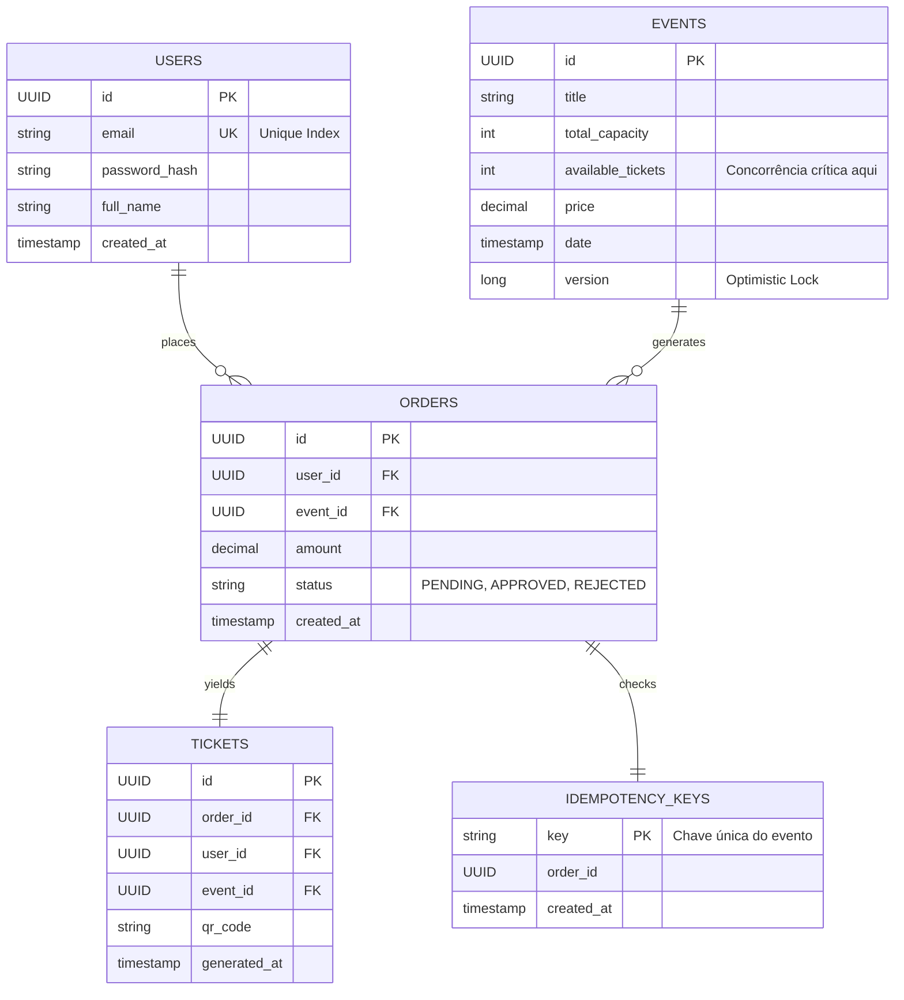

```mermaid
erDiagram
    USERS {
        UUID id PK
        string email UK "Unique Index"
        string password_hash
        string full_name
        timestamp created_at
    }

    EVENTS {
        UUID id PK
        string title
        int total_capacity
        int available_tickets "Concorrência crítica aqui"
        decimal price
        timestamp date
        long version "Optimistic Lock"
    }

    ORDERS {
        UUID id PK
        UUID user_id FK
        UUID event_id FK
        decimal amount
        string status "PENDING, APPROVED, REJECTED"
        timestamp created_at
    }

    TICKETS {
        UUID id PK
        UUID order_id FK
        UUID user_id FK
        UUID event_id FK
        string qr_code
        timestamp generated_at
    }
    
    IDEMPOTENCY_KEYS {
        string key PK "Chave única do evento"
        UUID order_id
        timestamp created_at
    }

    USERS ||--o{ ORDERS : places
    EVENTS ||--o{ ORDERS : generates
    ORDERS ||--|| TICKETS : yields
    ORDERS ||--|| IDEMPOTENCY_KEYS : checks
```